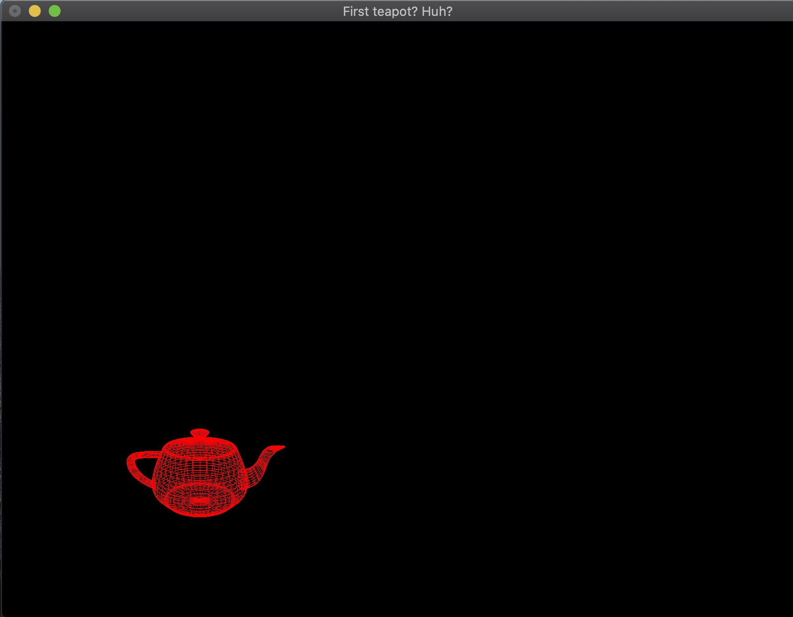
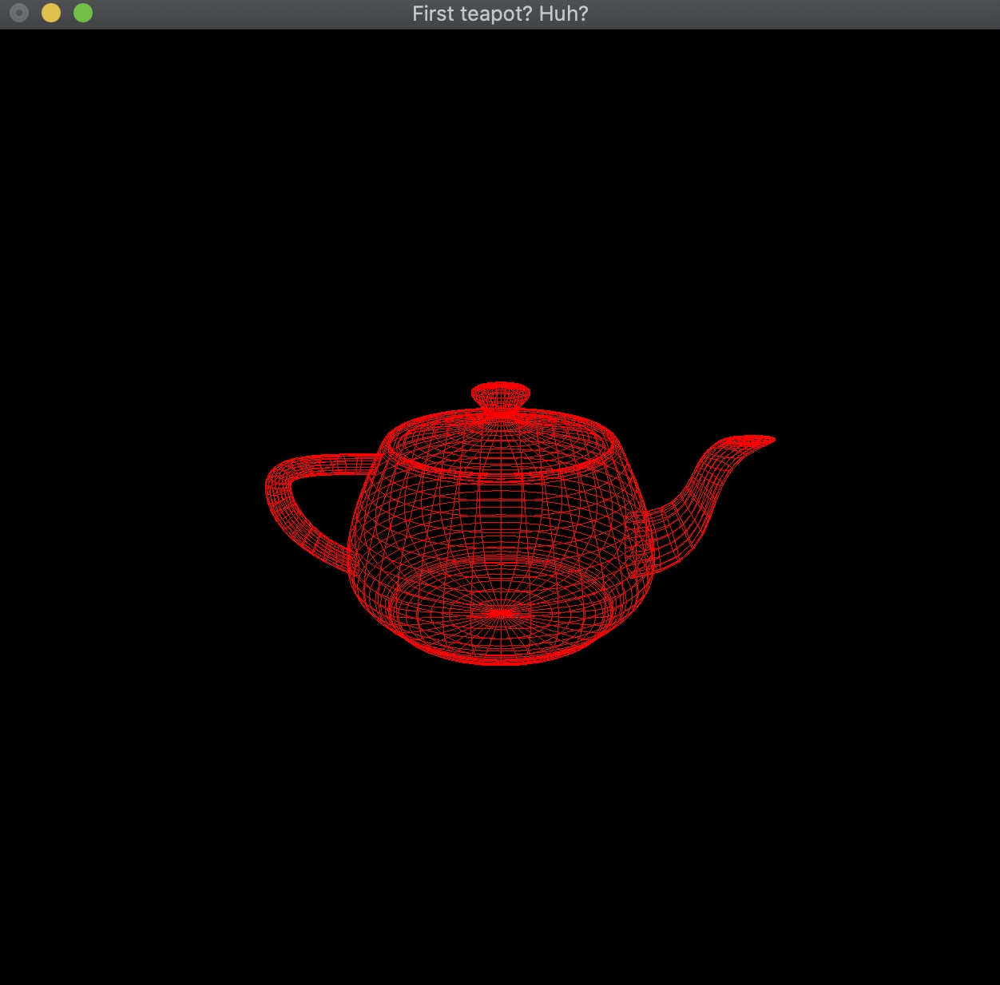

## First teapot? Huh?
- In this section. I using a well-known GLUT funciton which is glutWireTeapot to help me draw the teapot quickly and there's a MyReshape function for reshape the teapot when you change the size of window.

- Reshape the teapot

