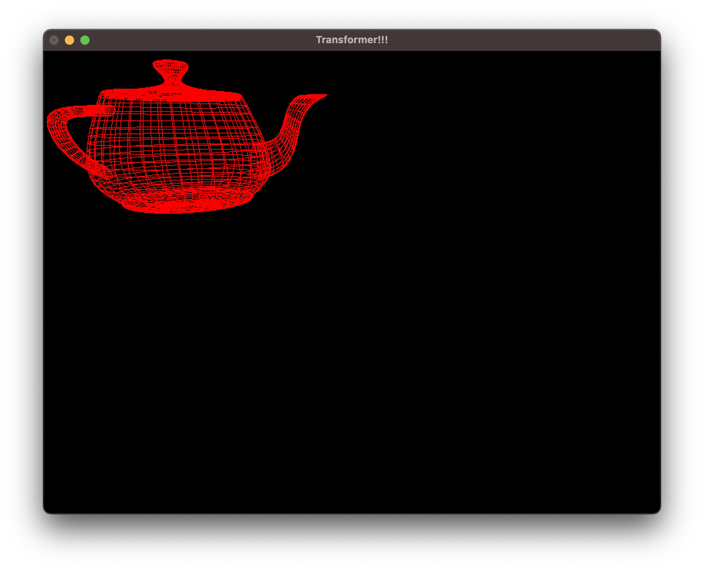

## Transformer!!!
- Corresbonding the previous section. I add some input to transform the size, position, color for the teapot.

- Change the teapot color by F1/F2/F3 keys

- Reshape the teapot size

- Transform the teapot position by W/S/A/D keys

